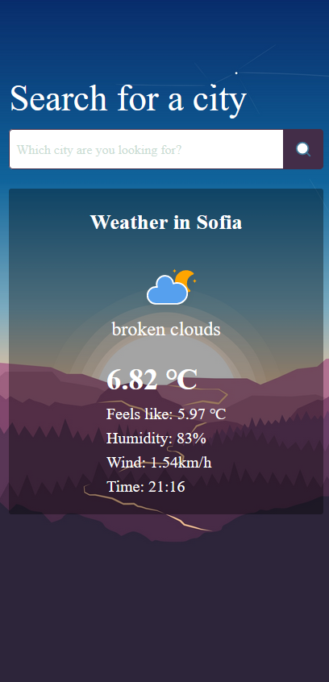

# Weather App
### Live DEMO at [Minimalistic Weather App](https://minimalistic-weather-forecast.onrender.com/)

#### Technoloogies

- [PageJS](https://visionmedia.github.io/page.js/)
- [Lit-html](https://lit.dev/docs/v1/lit-html/introduction/)
- [OpenWeather API](https://openweathermap.org/) + custom [Express Proxy Server](https://github.com/flnx/Express-Proxy/)

Works in almost all languages
 
Desktop                    |  Mobile
:-------------------------:|:-------------------------:
   |   
